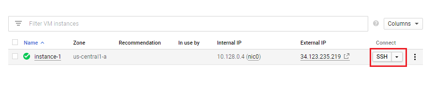

<br><br>
<br><br>
<br><br>

# Compute Engine + moving instance


## LAB Overview

#### In this lab you will create Compute Engine which will be moved to different zones.

## Task 1: Create Compute Engine with appropriate configuration

1. Create new Compute Engine instance with configuration similar like in previous Lab, but we will use different base image:

```
Region: europe-west1
Zone: europe-west1-b

Firewall settings
Allow HTTP traffic: mark checkbox
Allow HTTPs traffic: mark checkbox
```

2. Before creating the instance, we need to change base image from which instance will boot. To do this, in ``Boot disk`` configuration select change and change operating system image to Debian with version Debian GNU/Linux 9 (stretch):


3. We will also add another new Disk which will be attached to our instance. To do so, go to ``Management, security, disks, networking, sole tenancy`` and select Disks tab. There click on ``Add new disk`` and change following settings:

```
Type: Standard persistent disk
Size (GB): 100
```


Disks name can be left as it is.

4. After everything is configured, hit ``Create`` button to create instance.

5. Verify that you have created new instance, and verify that you have created additional disk under Disk view. As you see, it should be in europe-west1-b zone.


## Task 2. Creating some random data on the additional disk.
Create some random on the additional disk for later use.

1. SSH to the virtual machine instance:



2. Now you need to check ID of the additonal disk that is attached to the instance using ``lsblk`` command and format it using following commands in bash:

```
sudo lsblk
```
And following command will format disk so we can mount it later:
```
sudo mkfs.ext4 -m 0 -F -E lazy_itable_init=0,lazy_journal_init=0,discard /dev/<DISK_ID>
```

3. After disk is formatted, we can attach it, create some catalog and file in it (to quit ``nano`` use ``ctrl+x`` then ``y`` then ``enter``):

```
sudo mkdir -p /disk2
sudo mount -o discard,defaults /dev/sdb /disk2
sudo chmod a+w /disk2
cd /disk2
touch file.txt
nano file.txt
```

4. Disconnect from instance:

```
exit
```

## Task 3. Moving instance to different zone.
In this task you will move instance to different zone.

1. Open Cloud Shell using terminal button in upper right part of GCP:


2. After shell opens, your project should set as default. To try it, you can run command to check what instances you have in your project:

```
gcloud compute instances list
```

3. To move your instance to different zone we can use ``move`` gcloud command as following, where we point source and target destination zone (from ``europe-west1-b`` to ``europe-west1-c``):

```
gcloud compute instances move <INSTANCE_NAME> --destination-zone=europe-west1-c --zone=europe-west1-b
```
4. This operation may take a while, but after few moments instance and disks should be moved to new zone (you can view it in ``VM instances`` and ``Disks`` views):


## Task 4. Moving instance to different region.

To move instance and its disks between regions, we must create snapshots of disks which will have to be moved.

1. Now you will create a snapshot of a disk from currently running VM in zone ``europe-west1-c`` using Cloud Shell. Then verify in ``Snapshots`` view that snapshot was created.

```
gcloud compute disks snapshot <source-disk-name> --snapshot-names <snapshot-name> --zone europe-west1-c
```

2. Next step is to create new disk from previous snapshot in different region, where we will want to move our solution. To do so, we can also do it with a ``gcloud`` command. We create this disk in different region ``us-central1``, in zone ``us-central1-c``:

```
gcloud compute disks create <new-disk-name> --source-snapshot <snapshot-name> --zone us-central1-c
```

3. When we have disk created in new zone, then we can create new Compute Engine instance, and attach previously created disk to it:

```
gcloud compute instances create <new-instance-name> --machine-type e2-medium --tags=http-server,https-server --image=debian-9-stretch-v20210217 --image-project=debian-cloud --zone us-central1-c
```
```
gcloud compute instances attach-disk <new-instance-name> --disk <new-disk-name> --zone us-central1-c
```

## Task 5. Verify if data exists on new instance with copied disk.
We will connect to new instance, mount attached disk and verify that previously created file exist.

1. SSH to the newly created instance like in the first time.

2. Mount the disk and verify that file exists:

```
sudo mkdir -p /disk2
sudo mount -o discard,defaults /dev/sdb /disk2
sudo chmod a+w /disk2
cd /disk2
cat file.txt
```

3. Disconnect from instance:
```
exit
```

## Task 6. Cleanup resources.

1. Delete previously created instances.
2. Delete remaining disks.
3. Delete snapshot.


## END LAB

<br><br>

<center><p>&copy; 2020 Chmurowisko Sp. z o.o.<p></center>
