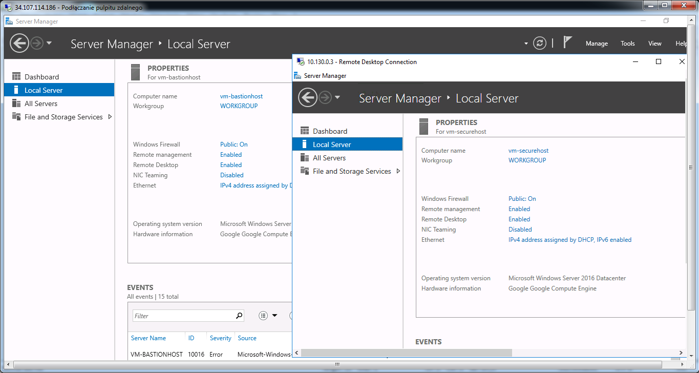

<br><br>
<br><br>
<br><br>

# VPC Bastion Host

## LAB Overview

In this lab, you will create two Windows compute instances connected to the same network.

The first instance (the Bastion) acts as a trusted relay for any inbound connections to your network. It'll have an external IP address and will be available publically.
The second instance won't have external IP addresses and can only be reached by other instances on the network.

## Step 1: Open Cloud Shell Editor

1. Log into Google Cloud Platform
1. Activate Cloud Shell
1. Open Editor
1. Open any Workspace
1. Create a new directory named `bastion`

## Step 2: Create deployment files

1. Inside `./bastion` directory create new 3 files named:

- `config.yaml`
- `vm-bastionhost.jinja`
- `vm-securehost.jinja`

1. Copy and paste files content from [`/files` directory (link)](./files)

## Step 3: Create new deployment using Deployment Manager

1. Run the following command:

```shell
gcloud deployment-manager deployments create my-deployment --config=config.yaml
```

## Step 4: Set credentials for `vm-bastionhost`

1. Run the following command

```shell
gcloud compute reset-windows-password vm-bastionhost
```

- press (Y) when gcloud asks if you would like to set or reset the password.
- if you get an error _"The instance may not be ready for use."_ wait ~1 minute and try again.

1. Copy `ip_address`, login, and password


## Step 5: Set credentials for `vm-securehost`

1. Run the following command

```shell
gcloud compute reset-windows-password vm-securehost
```

- press (Y) when gcloud asks if you would like to set or reset the password.
- if you get an error _"The instance may not be ready for use."_ wait ~1 minute and try again.

## Step 6: Get IP address of `vm-securehost` in secure-subnetwork

1. Run the following command:

```shell
gcloud compute instances describe vm-securehost --format='get(networkInterfaces.networkIP)'
```

## Step 7: Wait ~5 minutes for VM instances to set up after deployment

## Step 8: Log into `vm-bastionhost`

1. Open Remote Desktop Connection
1. Paste IP address and your login
1. Connect to the remote instance
1. Paste your password

**Attention**: If the password does not work try to reset it again using (without waiting for instances to set up again):

```shell
gcloud compute reset-windows-password vm-bastionhost
```

## Set 9: Log into `vm-securehost` from `vm-bastionhost`

1. Open Remote Desktop Connection (on `vm-bastionhost` remote instance)
1. Paste IP address of `vm-securehost` and your login
1. Connect to the remote instance
1. Paste your password

The result you get should look like this:



## Step 10: Delete deployment

1. Open Cloud Shell Terminal
1. Run command:

```shell
gcloud deployment-manager deployments delete my-deployment
```

(and press 'y')

## END LAB

<br><br>

<center><p>&copy; 2021 Chmurowisko Sp. z o.o.<p></center>
