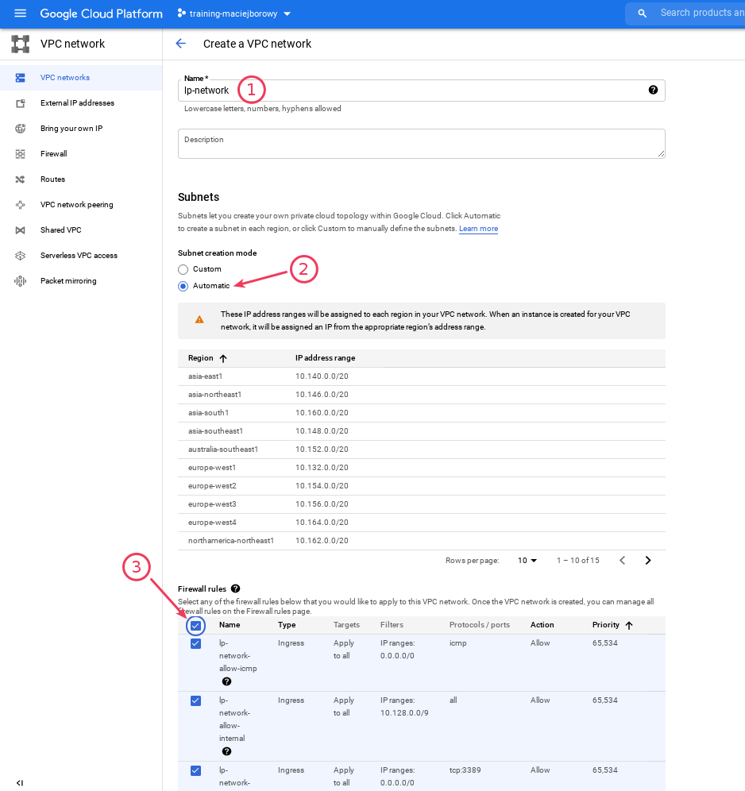
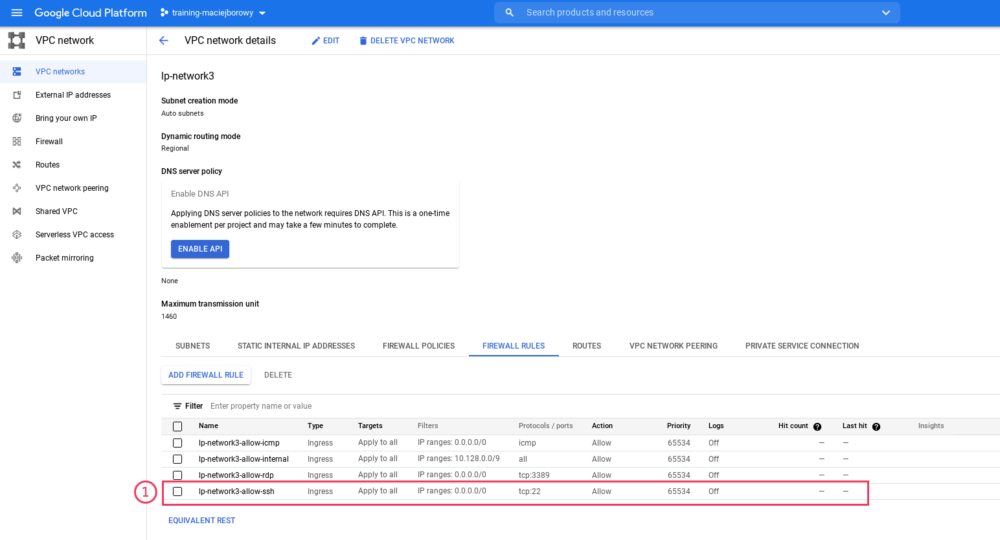
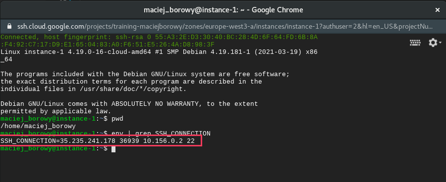
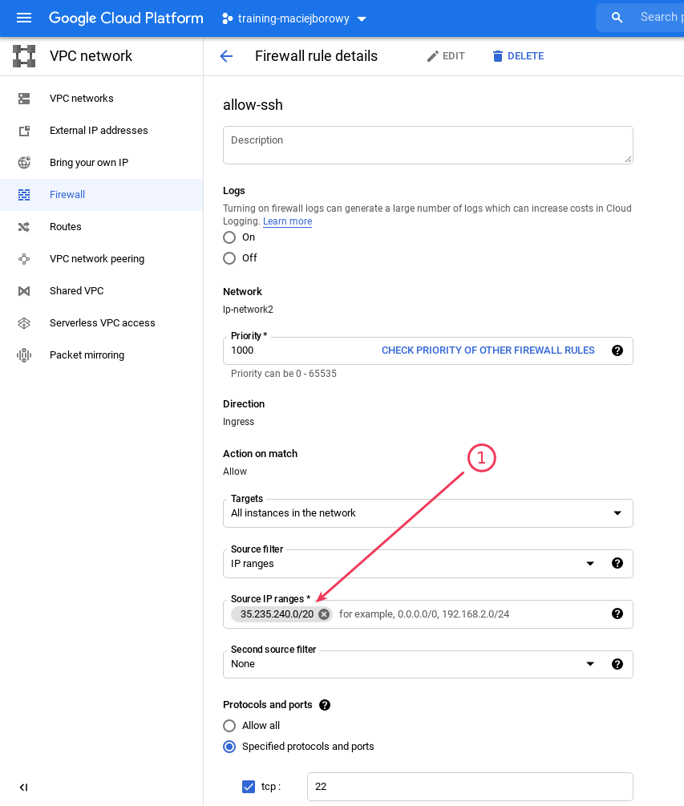

<br><br>
<br><br>
<br><br>

# Restrict SSH access

## LAB Overview

In this lab, you'll restrict access to your VM via SSH to work only through GCP portal.

---

1. Create a new _VPC Network_ and configure it as follows:

   - name `lp-network`
   - change _Subnet creation mode_ to _Automatic_
   - select all _Firewall rules_

   

1. Check details of your new _VPC network_. Check if there is a rule allowing SSH (`tcp:22`) for every one (`IP range: 0.0.0.0/0`)

   

1. Create a single new _VM instance_ connected to your new network

   Configure your VM instance as follows:

   - region: `europe-west3`
   - zone: `europe-west3-a`
   - Machine type: `e2-micro`
   - Networking > Network interfaces: `lp-network` (confirm by pressing `Done`)

1. Verify you can SSH into VM via the portal.

   

1. Check SSH connection details. Check if the IP address is part of the range `35.235.240.0/20`.

   ```bash
   env | grep SSH_CONNECTION
   ```

   

1. Verify you can SSH into it via your local machine

   ```bash
   gcloud compute ssh --project=<YOUR-PROJECT-NAME> --zone=<VM-ZONE> <VM NAME>
   ```

1. Check SSH connection details. It should differ from the SSH connection made via the portal

   ```bash
   env | grep SSH_CONNECTION
   ```

1. Modify your network. Restrict access to SSH only for IP addresses that belong to the `35.235.240.0/20` range.

   

1. Check if you can SSH into VM via the portal.
1. Check if you can SSH into VM from your local machine.

## END LAB

<br><br>

<center><p>&copy; 2021 Chmurowisko Sp. z o.o.<p></center>
