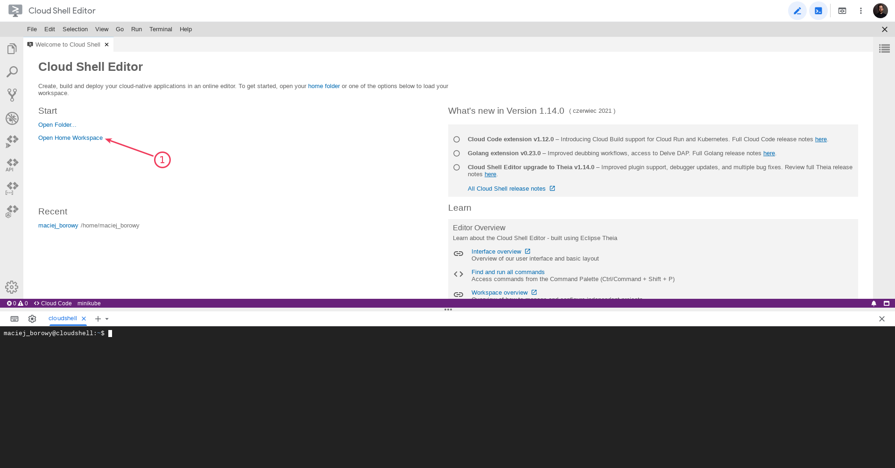
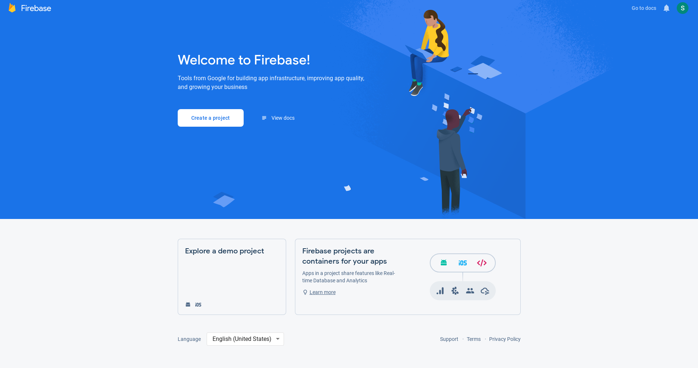
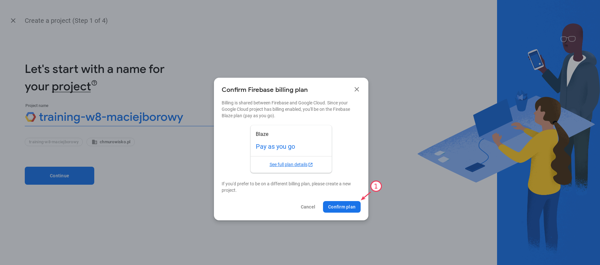

<br><br>
<br><br>
<br><br>

# Utworzenie projektu

W tym laboratorium utworzysz projekt w Firebase oraz zobaczysz jak używać Firebase CLI

## Krok 1: Uruchom Cloud Shell

1. Przejdź do [Cloud Shell](https://shell.cloud.google.com/) i otwórz "Home Workspace".

   

1. W terminalu wykonaj komendę

   ```bash
   firebase login --no-localhost
   ```

   Zrezygnuj z udostępniania danych telemetrycznych, jeśli zostaniesz zapytany:

   ```bash
   ? Allow Firebase to collect CLI usage and error reporting information? (Y/n) n
   ```

1. Kliknij w link do logowania i zaloguj się kontem studenta. Zezwól na dostęp do Firebase CLI. Skopiuj kod logowania.

1. Wróć do Cloud Shell i w terminalu wklej kod logowania.

1. Wykonaj komende:

   ```bash
   firebase projects:list
   ```

   Powinieneś otrzymać odpowiedź:

   ```bash
   ✔ Preparing the list of your Firebase projects
   No projects found.
   ```

## Krok 1 (opcjonalny): Zainstaluj Firebase CLI lokalnie

Firebase dostarcza emulator, który pozwala testować lokalnie Firebase. Podczas warsztatów pokażę jak go użyć. Emulator nie jest Ci potrzebny jeśli nie chcesz używać emulatora, a tylko uruchomić funkcję w środowisku GCP.

1. Zainstaluj Firebase CLI zgodnie z instrukcjami dla swojego OS - https://firebase.google.com/docs/cli#install_the_firebase_cli. Nie instaluj Firebase przez npm.

   Dla Linux wywołaj komendę:

   ```bash
   curl -sL https://firebase.tools | bash
   ```

1. Spróbuj zalogować się do Firebase z lokalnego terminala (jak w kroku 1.)

1. Kolejne komendy możesz wykonać z poziomu własnego termianala.

## Krok 2: Utwórz nowy projekt w Firebase

1. Przejdź do [Firebase Console](https://console.firebase.google.com/). Upewnij się, że jesteś zalogowany kontem studenta. W tym momencie nie powinieneś mieć żadnego projektu.

   

1. Kliknij "Create a project". Wybierz sugerowaną nazwę projektu (według wzorca: `training-w8-lpstudentXX`). Potwierdź zaproponowany plan billingowy ("Blaze - pay as you go").

   

1. Wyłącz Google Analytics dla tego projektu (nie będziesz musiał go konfigurować 😃)

1. Kiedy projekt będzie gotowy wróć do Cloud Shell i ponownie wykonaj komendę:

   ```bash
   firebase projects:list
   ```

   W odpowiedzi powinieneś otrzymać:

   ```bash
   ✔ Preparing the list of your Firebase projects
   ┌──────────────────────────┬──────────────────────────┬────────────────┬──────────────────────┐
   │ Project Display Name     │ Project ID               │ Project Number │ Resource Location ID │
   ├──────────────────────────┼──────────────────────────┼────────────────┼──────────────────────┤
   │ training-w8-maciejborowy │ training-w8-maciejborowy │ 792703210973   │ [Not specified]      │
   └──────────────────────────┴──────────────────────────┴────────────────┴──────────────────────┘

   1 project(s) total.
   ```

## Krok 3: Utwórz bazę Firestore

1. W menu Firebase znajdź "Firestore Database" i otwórz tę stronę.
1. Kliknij w "Create database". W modal wybierz "Production mode" i kliknij "Next".
1. Wybierz region `eur3` i kliknij "Enable"

## Krok 4: Przygotuj aplikację

1. Utwórz nowy folder `/app` i przejdź do niego
1. Wykonaj komendę

   ```bash
   firebase init
   ```

1. Zaznacz opcje, które chcesz, żeby zostały skonfigurowane (u Ciebie może być inna kolejność punktów): 

   ```bash
   ◉ Functions: Configure a Cloud Functions directory and its files
   ◉ Hosting: Configure files for Firebase Hosting and (optionally) set up GitHub Action deploys
   ◯ Hosting: Set up GitHub Action deploys
   ◯ Storage: Configure a security rules file for Cloud Storage
   ◉ Emulators: Set up local emulators for Firebase products
   ◯ Remote Config: Configure a template file for Remote Config
   ◯ Realtime Database: Configure a security rules file for Realtime Database and (optionally) provision default instance
   ◉ Firestore: Configure security rules and indexes files for Firestore
   ```

   Funkcje oznaczone `◉` zostaną skonfigurowane w Twojej aplikacji.

   Zaznaczenie potwierdź `Enter`

1. Wybierz swój projekt oraz potwierdź wartości sugerowane przez CLI dla Firestore rules oraz Firestore indexes
1. Wybierz Typescript (dalszy kod będzie w TypeScript), potwierdź ESLint i potwierdź instalację paczek npm.
1. W kolejnych krokach wpisz poniższe wartości:

   ```bash
   ? What do you want to use as your public directory? public
   ? Configure as a single-page app (rewrite all urls to /index.html)? Yes
   ? Set up automatic builds and deploys with GitHub? No
   
   === Emulators Setup
   ? Which Firebase emulators do you want to set up? Press Space to select emulators, then Enter to confirm your choices. Authentication Emulator, Functions Emulator, Firestore Emulator,    Hosting Emulator
   ? Which port do you want to use for the auth emulator? 9099
   ? Which port do you want to use for the functions emulator? 5001
   ? Which port do you want to use for the firestore emulator? 8080
   ? Which port do you want to use for the hosting emulator? 5000
   ? Would you like to enable the Emulator UI? Yes
   ? Which port do you want to use for the Emulator UI (leave empty to use any available port)?
   ? Would you like to download the emulators now? Yes
   
   ✔  Firebase initialization complete!
   ```

---

**Koniec laboratorium**

<br><br>

<center><p>&copy; 2021 Chmurowisko Sp. z o.o.<p></center>
