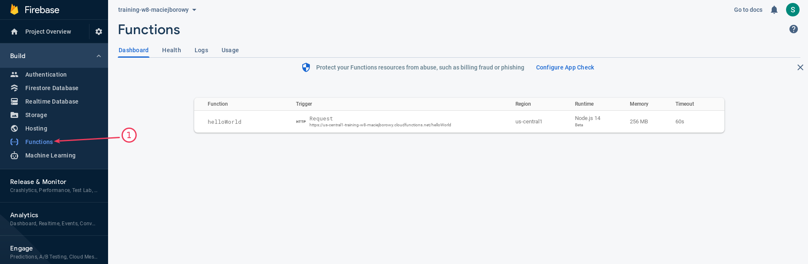
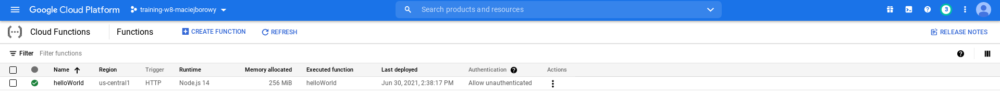

<br><br>
<br><br>
<br><br>

# Pierwsza funkcja

W tym ćwiczeniu stworzysz swoją pierwszą funkcję i wdrożysz ją na GCP

## Krok 1: Stwórz pierwszą funkcję w GCP

1. Otwórz plik `app/functions/src/index.ts` i odkomentuj kod funkcji `helloWorld`.
1. Zapisz plik

## Krok 2: Udostępnij funkcję na Firebase

1. Przejdź do katalogu `app/functions` i wykonaj poniższą komendę:

   ```bash
   firebase deploy --only functions
   ```

   W efekcie powinieneś zobaczyć adres funkcij:

   ```bash
   Function URL (helloWorld([region])): https://[region]-[project-id].cloudfunctions.net/helloWorld
   ```

## Krok 3: Przetestuj odpowiedź z funkcji

1. Wykonaj request do funkcji:

   ```bash
   curl https://[region]-[project-id].cloudfunctions.net/helloWorld
   ```

## Krok 4: Wyświetl listę funkcji w projekcie

1. `Firebase CLI` nie dostarcza komendy, która pozwala wyświetlić listę funkcji. Musimy skorzystać z `gcloud CLI`:

   ```bash
   gcloud functions list
   ```

1. Otwórz przeglądarkę i wyświetl listę funkcji w [Firebase Console](https://console.firebase.google.com/)

   

1. Wyświetl listę funkcji w Cloud Console. Wybierz menu [Cloud Functions](https://console.cloud.google.com/functions).

   

## Krok 5: Sprawdź logi funkcji

1. Sprawdź logi aplikacji za pomocą komendy

   ```bash
   firebase functions:log
   ```

1. Sprawdź logi aplikacji w [Cloud Operations Logging](https://console.cloud.google.com/logs)

## Krok 6: Utwórz custom metric (Cloud Monitoring)

1. Przejdź do kodu funkcji `helloWorld` i zmień go na poniższy (dodaj dodatkowy log):

   ```typescript
   export const helloWorld = functions.https.onRequest((request, response) => {
     functions.logger.info("Hello logs!", {structuredData: true});
     functions.logger.info({price: Math.random() * 100});
     response.send("Hello from Firebase!");
   });
   ```

1. Przejdź do [Cloud Operations Logging](https://console.cloud.google.com/logs/), kliknij w [Logs-based Metrics](https://console.cloud.google.com/logs/metrics), a następnie kliknij w "Create metric". Skonfiguruj metrykę jak poniżej:

   ```bash
   Metric Type: Counter
   Log metric name: ordersAbove50Dollars
   Units: 1
   Build filter: jsonPayload.price>50
   ```

1. Kliknij "Create metric"
1. Przejdź do [Cloud Operations Metrics](https://console.cloud.google.com/monitoring), kliknij w [Metrics explorer](https://console.cloud.google.com/monitoring/metrics-explorer). W formularzu wyszukiwania metyki znajdź:

   ```bash
   Resource type: cloud_function
   Metric: logging/user/ordersAbove50Dollars
   ```

1. Skonfiguruj metrykę, żeby wyświetlała sumę zamówień powyżej 50$ w danym przedziale czasu.

---

**Koniec laboratorium**

<br><br>

<center><p>&copy; 2021 Chmurowisko Sp. z o.o.<p></center>
