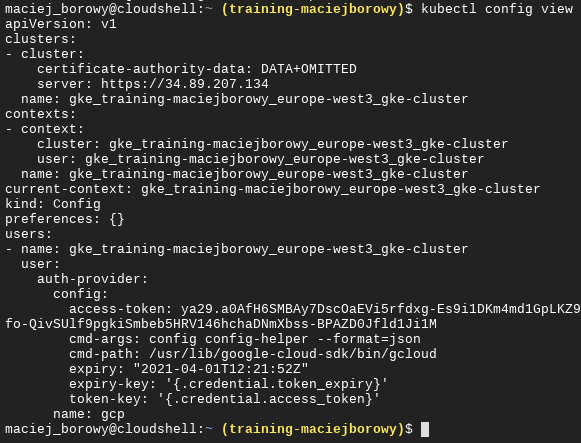

<br><br>
<br><br>
<br><br>

# Create GKE Cluster

1. Copy the following command, update the `[YOUR-PROJECT-ID]` and run it from Cloud Shell:

   ```bash
   export PROJECT_ID=`gcloud config get-value project` && \
   export M_TYPE=n1-standard-1 && \
   export REGION=europe-west3 && \
   export CLUSTER_NAME=${PROJECT_ID}-${RANDOM} && \
   export WORKLOAD=${PROJECT_ID}.svc.id.goog

   gcloud services enable container.googleapis.com && \
   gcloud container clusters create $CLUSTER_NAME \
   --cluster-version latest \
   --machine-type=$M_TYPE \
   --num-nodes 1 \
   --region $REGION \
   --project $PROJECT_ID \
   --workload-pool=$WORKLOAD
   ```

   This commend will create GKE cluster. It takes approx. 3 minutes to create a cluster.

   You can find _Project ID_ on the Dashboard page in GCP (in the navigation menu choose _Home_ > _Dashboard_)

1. Verify that cluster is up and running:

   ```bash
   kubectl config view
   ```

   Cloud Shell has `kubectl` already installed.

   In the result you should get similar output:

   

## END LAB

<br>
<br>
<center><p>&copy; 2021 Chmurowisko Sp. z o.o.<p></center>
