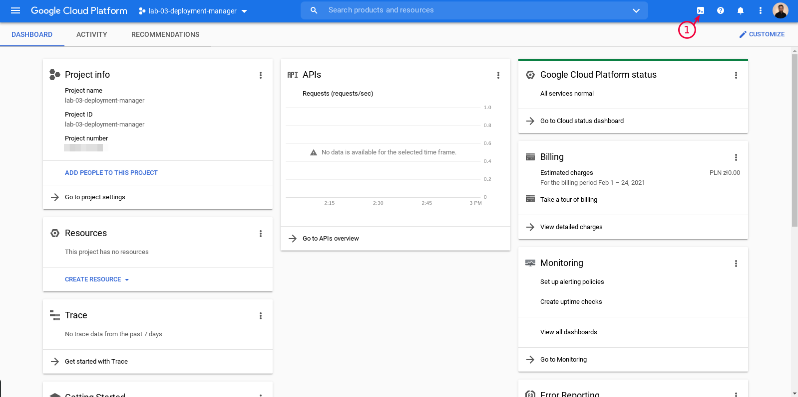
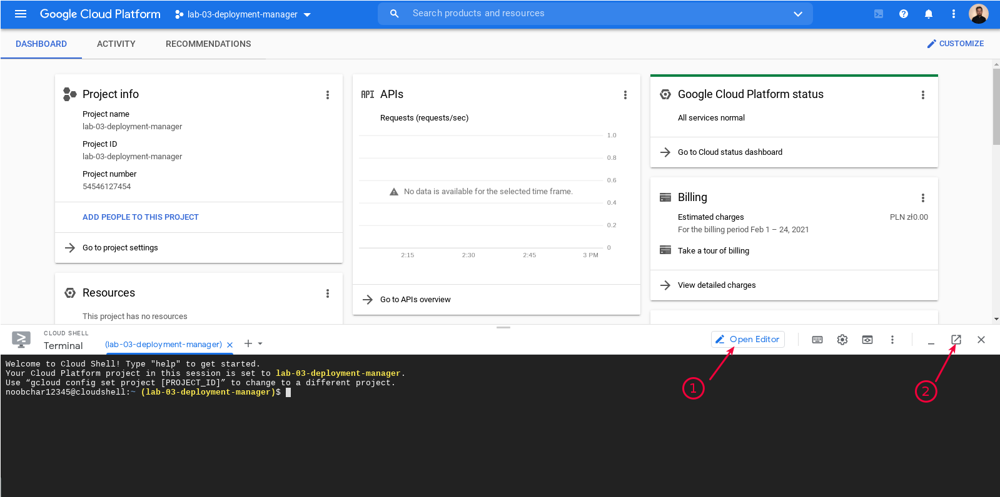
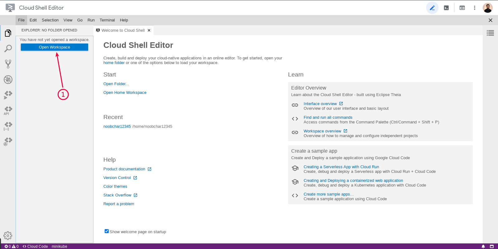
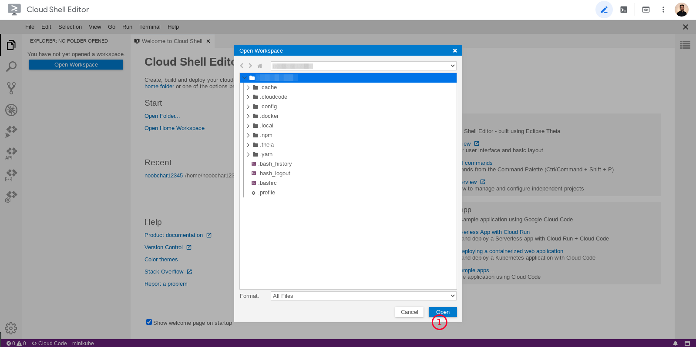
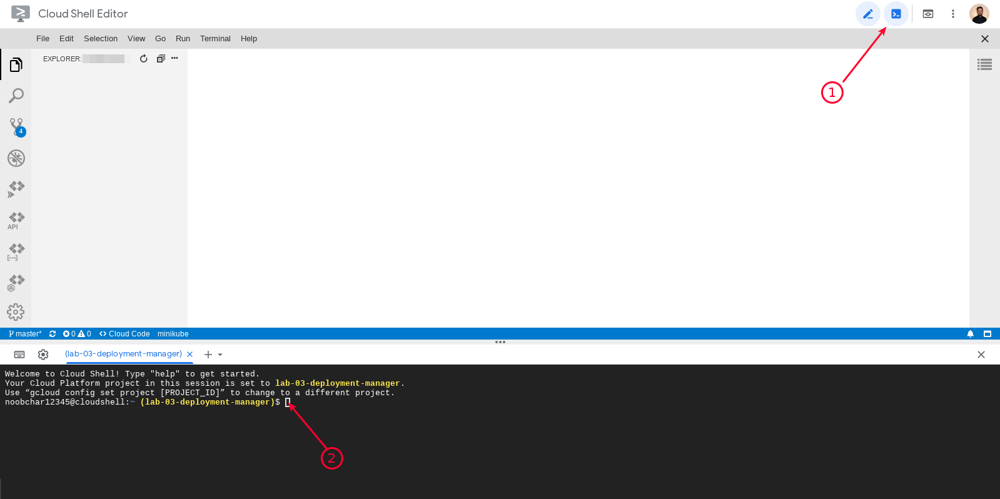
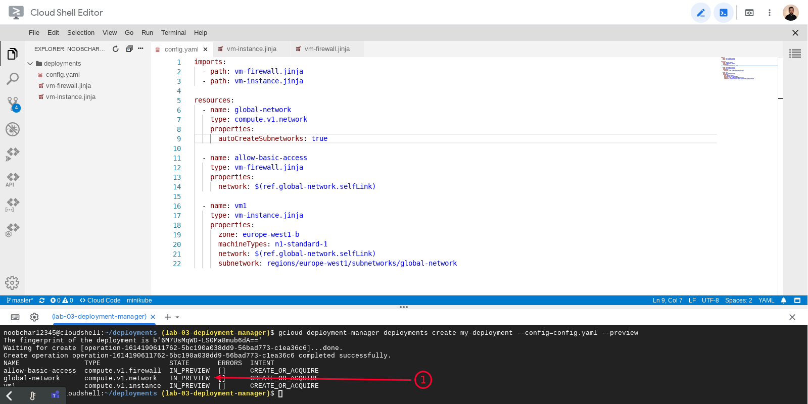
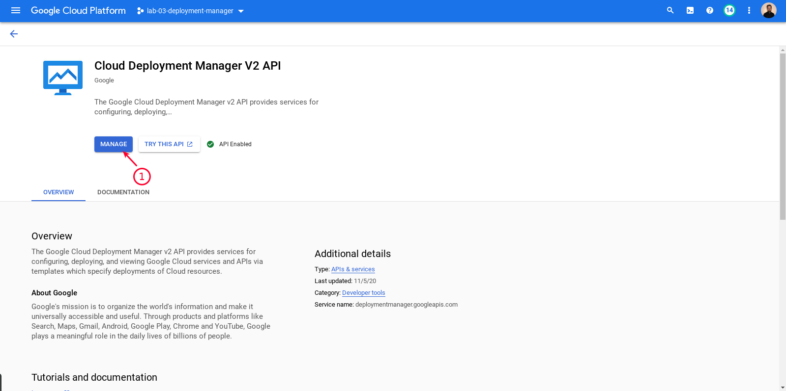
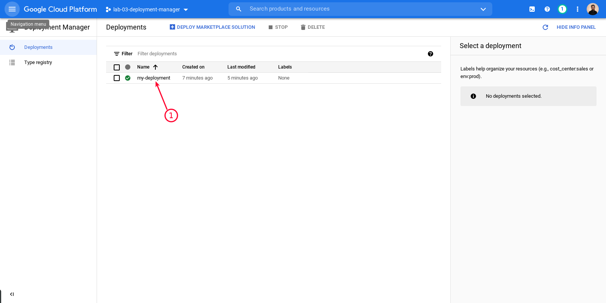
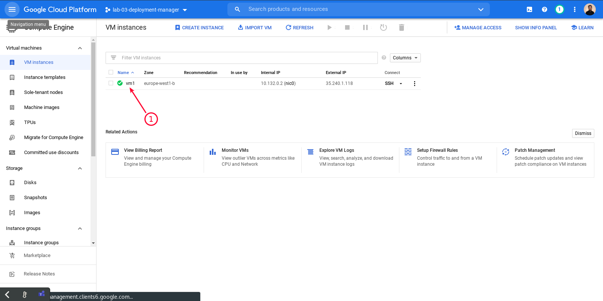
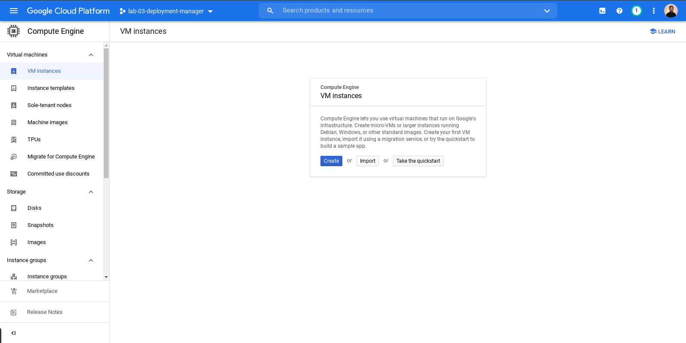

<br><br>
<br><br>
<br><br>

# Deployment Manager

## LAB Overview

Using deployment manager you'll create a new network, firewall, and VM instance.

## Step 1: Open Cloud Shell Editor

1. Open GCP Console:



2. Open Cloud Shell Editor:



3. Open default workspace (if you need to):




## Step 2: Create a new directory with the main deployment file

1. Create directory named `/deployment` (right click on Explorer & choose "New folder")
2. Inside directory `/deployment` create file named `config.yaml`.
3. Paste definition of a basic VPC network

   ```yaml
   resources:
     - name: global-network
       type: compute.v1.network
       properties:
         autoCreateSubnetworks: true
   ```

If you need more details about resource definitions visit: https://cloud.google.com/deployment-manager/docs/configuration/supported-resource-types

## Step 3: Create a template file for firewall resource

1. Create a file named `vm-firewall.jinja`
2. Paste definition of firewall

   ```yaml
   resources:
   - name: {{ env["name"] }}
     type: compute.v1.firewall
     properties:
       network: {{ properties["network"] }}
       sourceRanges: ["0.0.0.0/0"]
       allowed:
       - IPProtocol: TCP
         ports: [22, 80, 3389]
       - IPProtocol: ICMP
   ```

3. Import `vm-firewall.jinja` into `config.yaml`

- add import at the top of `config.yaml`

  ```yaml
  imports:
    - path: vm-firewall.jinja
  ```

- add new resource definition (at the bottom of `config.yaml`)

  ```yaml
  - name: allow-basic-access
    type: vm-firewall.jinja
    properties:
      network: $(ref.global-network.selfLink)
  ```

4. At the end of this step `config.yaml` should have the following content:

```yaml
imports:
  - path: vm-firewall.jinja

resources:
  - name: global-network
    type: compute.v1.network
    properties:
      autoCreateSubnetworks: true

  - name: allow-basic-access
    type: vm-firewall.jinja
    properties:
      network: $(ref.global-network.selfLink)
```

## Step 4: Create a template file for VM instance

1. Create a file named `vm-instance.jinja`
2. Paste definition of VM instance:

   ```yaml
   resources:
   - name: {{ env["name"] }}
     type: compute.v1.instance
     properties:
       machineType: zones/{{ properties["zone"] }}/machineTypes/{{ properties["machineType"] }}
       zone: {{ properties["zone"] }}
       networkInterfaces:
       - network: {{ properties["network"] }}
         subnetwork: {{ properties["subnetwork"] }}
         accessConfigs:
         - name: External NAT
           type: ONE_TO_ONE_NAT
       disks:
       - deviceName: {{ env["name"] }}
         type: PERSISTENT
         boot: true
         autoDelete: true
         initializeParams:
           sourceImage: https://www.googleapis.com/compute/v1/projects/debian-cloud/global/images/family/debian-9
   ```

3. Import `vm-instance.jinja` into `config.yaml` and paste the below code at the bottom of `config.yaml`:

   ```yaml
   - name: vm1
     type: vm-instance.jinja
     properties:
       zone: europe-west1-b
       machineType: n1-standard-1
       network: $(ref.global-network.selfLink)
       subnetwork: regions/europe-west1/subnetworks/global-network
   ```

4. At the end of this step `config.yaml` should have the following content:

```yaml
imports:
  - path: vm-firewall.jinja
  - path: vm-instance.jinja

resources:
  - name: global-network
    type: compute.v1.network
    properties:
      autoCreateSubnetworks: true

  - name: allow-basic-access
    type: vm-firewall.jinja
    properties:
      network: $(ref.global-network.selfLink)

  - name: vm1
    type: vm-instance.jinja
    properties:
      zone: europe-west1-b
      machineType: n1-standard-1
      network: $(ref.global-network.selfLink)
      subnetwork: regions/europe-west1/subnetworks/global-network
```

## Step 5: Create a preview of resource deployment

1. Open Cloud Shell Terminal



2. Run below command:

```shell
gcloud deployment-manager deployments create my-deployment --config=config.yaml --preview
```

3. Verify if all resources has `IN_PREVIEW` status meaning they are ready to be deployed



4. Update deployment to actually deploy all resources

```shell
gcloud deployment-manager deployments update my-deployment
```

## Step 6: Check how successful deployment looks in Web Console

1. Go to Web Console > Navigation menu > Deployment Manager > Deployments

   In case you see the screen below, click "Manage". If you see this screen again, wait a few seconds to let GCP update your configuration and refresh the page.

   

1. Check if `my-deployment` is listed on the page.

   

1. Go to Web Console > Navigation menu > Compute engine > VM instances.
1. Check if `vm1` is listed on the page

   

## Step 7: Delete deployment and all related resources

1. Go to Cloud Shell Terminal
1. Run:

   ```shell
   gcloud deployment-manager deployments delete my-deployment
   ```

1. Verify if:

- `vm1` is not listed on the Compute Engine > VM instances page

  

- `my-deployment` is not listed on the Deployment Manager > Deployments page

  

## END LAB

<br><br>

<center><p>&copy; 2021 Chmurowisko Sp. z o.o.<p></center>
