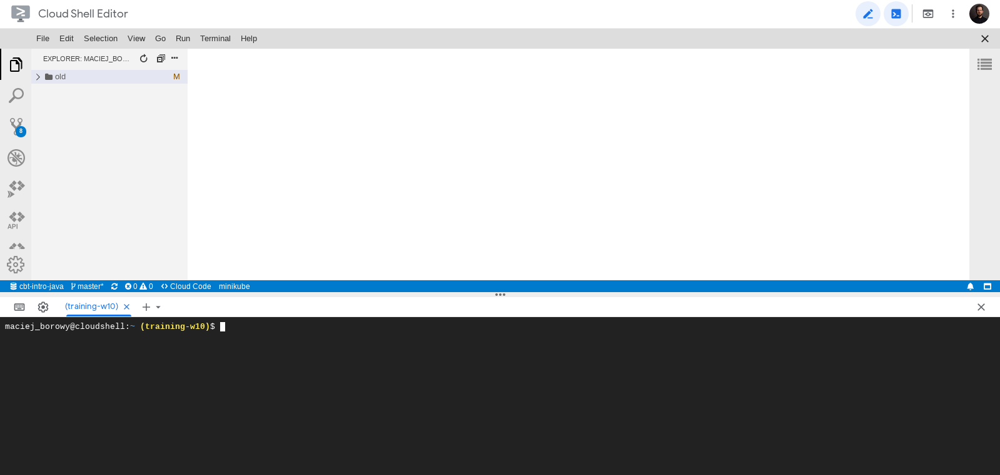

<br><br>
<br><br>
<br><br>

# Stworzenie sieci za pomocą Terraform

W tym kroku zobaczysz w jaki sposób utworzyć zasoby na GCP za pomocą Terraform

## Krok 1: Uruchom Cloud Shell

1. Uruchom Cloud Shell

    

## Krok 2: Utwórz Service Account

1. Utwórz Service Account

    ```bash
    gcloud iam service-accounts create sa-terraform --description "Terraform Service Account" --display-name "sa-terraform"
    gcloud iam service-accounts list
    ```

1. Nadaj rolę Editor dla utworzonego Service Account (zastąp `training-w10-lpstudentXX` własną wartością)

    ```bash
    gcloud projects add-iam-policy-binding training-w10-lpstudentXX \
      --member=serviceAccount:sa-terraform@training-w10-lpstudentXX.iam.gserviceaccount.com --role=roles/editor
    ```

1. Utwórz klucz dla Service Account (zastąp `training-w10-lpstudentXX` własną wartością)

    ```bash
    gcloud iam service-accounts keys create ~/key.json --iam-account sa-terraform@training-w10-lpstudentXX.iam.gserviceaccount.com
    ```

## Krok 3: Utwórz plik z infrastrukturą

1. Utwórz nowy folder `terraform/01_basics`
1. Utwórz nowy plik `main.tf`
1. Wklej do pliku poniższą zawartość. Zastąp `training-w10-lpstudentXX` własną wartością. Sprawdź czy ścieżka do pliku `key.json` jest poprawna.

    ```bash
    terraform {
      required_providers {
        google = {
          source = "hashicorp/google"
          version = "3.5.0"
        }
      }
    }

    provider "google" {
      credentials = file("~/key.json")

      project = "training-w10-lpstudentXX"
      region  = "europe-west3"
      zone    = "europe-west3-a"
    }

    resource "google_compute_network" "vpc_network" {
      name = "terraform-network"
    }
    ```

## Krok 4: Utwórz infrastrukturę

1. Wykonaj poniższe komendy

    ```bash
    terraform init # instaluje hashicorp/google provider
    terraform apply # wdraża infrastrukturę
    ```

    > Częstym problemem podczas tworzenia zasobów w GCP jest brak włączonego API dla wybranej usługi (np. `compute.googleapis.com`). Problem objawia się komunikatem zwracanym przez Terraform:
    >
    > ```Error: Error creating Network: googleapi: Error 403: Compute Engine API has not been used in project 32536381362 before or it is disabled. Enable it by visiting https://console.developers.google.com/apis/api/compute.googleapis.com/overview?project=32536381362 then retry. If you enabled this API recently, wait a few minutes for the action to propagate to our systems and retry., accessNotConfigured```
    >
    > Aby rozwiązać problem należy włączyć API dla projektu.

## Krok 5: Sprawdź czy sieć została utworzona

1. Wykonaj poniższą komendę i sprawdź czy istnieje sieć `terraform-network`

    ```bash
    gcloud compute networks list
    ```

---

**Koniec laboratorium**

<br><br>

<center><p>&copy; 2021 Chmurowisko Sp. z o.o.<p></center>
