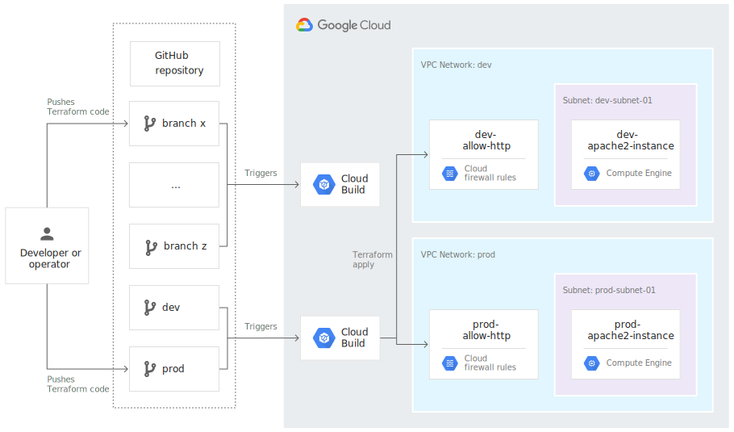
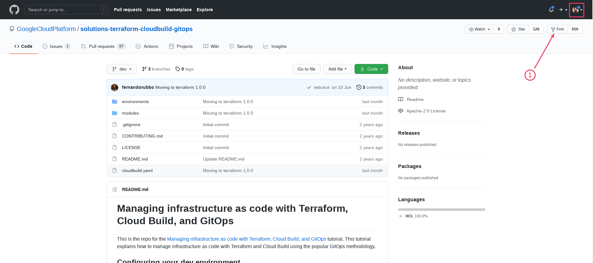
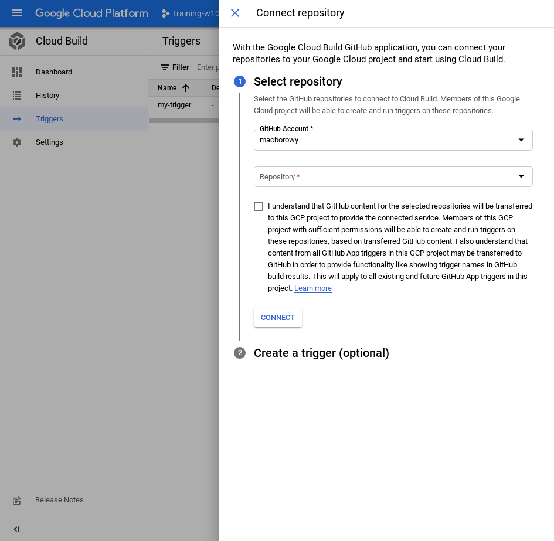

<br><br>
<br><br>
<br><br>

# Ciągłe wdrażanie infrastruktury za pomocą Terraform

W tym laboratorium zobaczysz jak w sposób ciągły możesz walidować i wdrażać infrastrukturę. Zobaczysz też jak zintegrować repozytorium na GitHub z GCP.



## Krok 1: Przygotuj środowisko

1. Ustaw informacje o swoim użytkowniku Git

    ```bash
    git config --global user.email "your-email-address"
    git config --global user.name "your-name"
    ```

1. Sforkuj [testowe repozytorium](https://github.com/GoogleCloudPlatform/solutions-terraform-cloudbuild-gitops.git). Żeby sforkować repozytorium musisz być zalogowany do GitHub.

    

1. Sklonuj **sforkowane** repozytorium w Cloud Shell

## Krok 2: Konfiguracja Terraform i GCP Storage Bucket

Konfigurujemy Terraform, aby stan środowisk `dev` i `prod` przechowywał w dedykowanym Bucket zamiast lokalnie na maszynie programisty.

1. Sprawdź zawartość pliku `./environments/<environment>/backend.tf`
1. Utwórz Cloud Storage Bucket

    ```bash
    PROJECT_ID=$(gcloud config get-value project)
    gsutil mb gs://${PROJECT_ID}-tfstate
    ```

1. Włącz opcję wersjonowania obiektów w Bucket (żeby przechowywać historię kolejnych wersji pliku stanu)

    ```bash
    gsutil versioning set on gs://${PROJECT_ID}-tfstate
    ```

1. Zastąp wszystkie `PROJECT_ID` w plikach Terraforma. W głównym katalogu repozytorium wykonaj poniższe komendy

    ```bash
    sed -i s/PROJECT_ID/$PROJECT_ID/g environments/*/terraform.tfvars
    sed -i s/PROJECT_ID/$PROJECT_ID/g environments/*/backend.tf
    ```

1. Wykonaj _commit & push_ wykonanych zmian

## Krok 3: Nadaj rolę dla Cloud Build do uruchomienia Terraform

1. Pobierz adres email Cloud Build Service Account 

    ```bash
    CLOUDBUILD_SA="$(gcloud projects describe $PROJECT_ID \
      --format 'value(projectNumber)')@cloudbuild.gserviceaccount.com"
    ```

1. Nadaj rolę `Editor` dla Cloud Build Service Account

    ```bash
    gcloud projects add-iam-policy-binding $PROJECT_ID \
      --member serviceAccount:$CLOUDBUILD_SA --role roles/editor
    ```

## Krok 4: Połącz GitHub z Cloud Build

1. Przejdź na stronę [GitHub Marketplace](https://github.com/marketplace/google-cloud-build). Na dole strony kliknij w przycisk "Setup with Google Cloud Build". Potwierdź dostęp do swojego konta. Nadaj dostęp tylko dla sforkowanego repozytorium. Zapisz zmiany.

    Powinieneś zostać przekierowany do Cloud Build w GCP. Google powinno automatycznie wykonać proces uwierzytelnienia w wyniku, którego zobaczysz poniższy widok. Jeśli Google nie udało się wykonać automatycznego uwierzytelnienia sprawdź czy strona nie blokuje wyskakujących okienek. Jeśli blokuje, zezwól na wyskakujące okienka i spróbuj ponownie wykonać krok uwierzytelnienia.

    

1. Wybierz odpowiednie repozytorium i kliknij "Connect"

1. Utwórz trigger. Uzupełnij wartości i kliknij "Create".

    - Podaj dowolną nazwę (np. `my-trigger`)
    - Event - `Push to a branch`
    - Source Repository - <wybierz repozytorium>
    - Branch - `.*`

## Krok 5: Zmodyfkuj infrastrukturę

1. Przejdź do repozytorium w GitHub, wybierz branch `dev`. Zmień treść pliku `modules/firewall/main.tf` - w atrybucie `target_tags` zmień wartość na `http-server`.
1. Utwórz nowy pull request. Poczekaj aż _check_ zostanie wykonany. Sprawdź w Cloud Build jakie kroki zostały wykonane. Porównaj jest z `cloudbuild.yaml`.
1. Wróc do repozytorium i zaakceptuj Pull Request. Sprawdź w Cloud Build jakie kroki zostały wykonane tym razem.
1. Sprawdź czy strona odpowiada.
1. Stwórz Pull Request promujący zmiany z branch `dev` do branch `prod`. Zaakceptuj Pull Request. Sprawdź czy strona odpowiada.

## Krok 6: Usuń repozytorium

1. Przejdź do strony GitHub z zainstalowanymi aplikacjami - https://github.com/settings/installations. Odinstaluj Google Cloud Build ("Configure" > "Danger zone" > "Uninstall Google Cloud Build"). Jeśli Google Cloud Build nadal pojawia się na liście aplikacji, odśwież stronę.
1. Usuń repozytorium z kodem (jeśli chcesz).

---

**Koniec laboratorium**

<br><br>

<center><p>&copy; 2021 Chmurowisko Sp. z o.o.<p></center>
